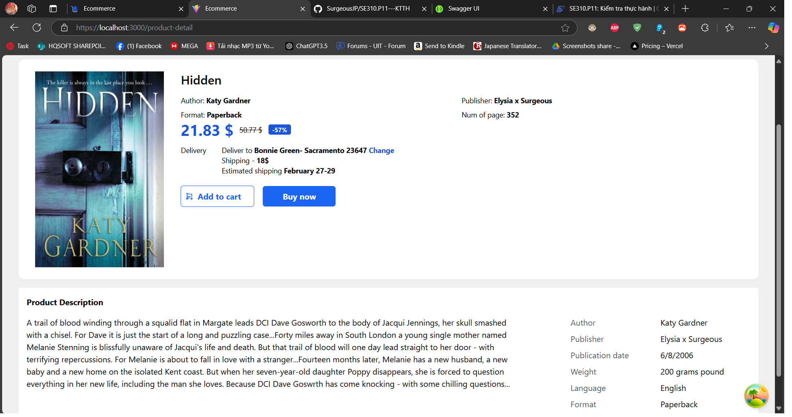

# SE310.P11---KTTH

## Accounts
User: b 2
Admin: a 1

## UI Screen

## Installation
TikiBackend: Dùng visual studio để chạy, không cần cài đặt gì nhiều

Tiki: vô project directory và chạy npm install -> để mở project thì chạy npm run dev

Về data, import từ file csv vào trong sql server thông qua click phải database -> task -> import flat file (bỏ cột id và thêm vào cột id identity sau), hoặc có thể nhập liệu data bằng tay để test
