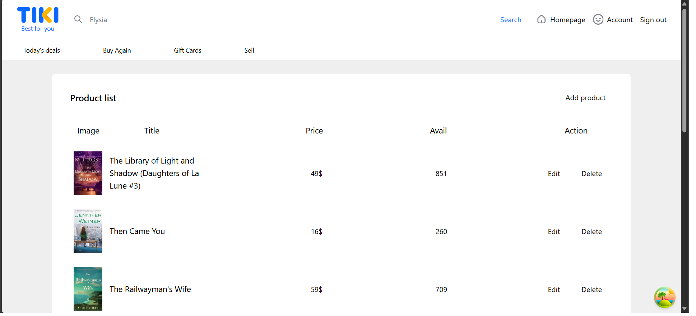

# SE310.P11---KTTH

## UI Screen

## Installation
TikiBackend: Dùng visual studio để chạy, không cần cài đặt gì nhiều
Tiki: vô project directory và chạy npm install -> để mở project thì chạy npm run dev
